# TDA 상태 구분력 검증 결과

> 실험일: 2026-05-14  
> 데이터: AI Hub 가전 30Hz 전력 데이터 (10종, ON 구간 슬라이딩 윈도우)  
> 노트북: `anomaly-detection/labeling/scripts/validate_tda_states.ipynb`  
> 이미지: `anomaly-detection/docs/figures/tda/`

---

## 목적

W-range(진폭 임계값) 분류만으로는 가전 동작 모드를 충분히 구분할 수 없다는 가설 검증.  
Ground Truth 레이블 없이 TDA(Topological Data Analysis)가 W 진폭과 독립적인 위상 구조를 찾는지 확인.

---

## 분석 파이프라인

```
ON 구간 신호
  → 슬라이딩 윈도우 (512 samples, 17초 @ 30Hz)
  → Time-delay 임베딩 (dim=3, lag=10)
  → ripser H1 → Persistence Image (20×20)
  → K-Means 클러스터링 (K = TDA 자동 선택)
  → Silhouette / NMI / 시간 일관성 평가
```

**정규화 두 종류 병행**
- **글로벌**: `signal / APPLIANCE_MAX_W` — 진폭 정보 보존
- **per-segment**: `(x - min) / (max - min)` — 진폭 제거, 파형 형태만 반영

---

## 1. Silhouette Score (5단계)

> W-range K 기준으로 K-Means 후 per-segment silhouette 측정.  
> **기준: sil ≥ 0.3 = TDA가 위상 구조를 찾음**

| 가전 | 글로벌 sil | per-seg sil | 판정 |
|------|-----------|-------------|------|
| 에어컨 | 0.541 | 0.504 | ✅ |
| 김치냉장고 | 0.605 | 0.690 | ✅ |
| 제습기 | 0.582 | 0.597 | ✅ |
| 세탁기 | 0.846 | 0.750 | ✅ |
| 의류건조기 | 0.527 | 0.483 | ✅ |
| 일반 냉장고 | 0.555 | 0.447 | ✅ |
| 식기세척기/건조기 | 0.451 | 0.507 | ✅ |
| 온수매트 | 0.587 | 0.540 | ✅ |
| 전기밥솥 | 0.706 | 0.771 | ✅ |
| 전기장판/담요 | 0.551 | 0.532 | ✅ |

전 가전 sil ≥ 0.3 → **TDA가 모든 대상 가전에서 위상 군집 구조를 발견함.**

---

## 2. NMI / ARI — W 진폭과의 독립성 (5-2단계)

> TDA 클러스터가 W 분포(qcut K-bin)와 얼마나 다른지 측정.  
> **NMI < 0.3 + sil ≥ 0.3 = TDA가 W로 설명 불가한 독립 구조 포착 (가장 강한 근거)**

| 가전 | K | NMI | ARI | per-seg sil | 판정 |
|------|---|-----|-----|-------------|------|
| 에어컨 | 3 | 0.092 | 0.028 | 0.548 | ✅ TDA 독립 구조 |
| 김치냉장고 | 3 | 0.248 | 0.135 | 0.690 | ✅ TDA 독립 구조 |
| 제습기 | 3 | 0.263 | 0.270 | 0.597 | ✅ TDA 독립 구조 |
| 세탁기 | 2 | 0.444 | 0.460 | 0.637 | △ W와 부분 일치 |
| 의류건조기 | 4 | 0.148 | 0.098 | 0.383 | ✅ TDA 독립 구조 |
| 일반 냉장고 | 3 | 0.193 | 0.117 | 0.447 | ✅ TDA 독립 구조 |
| 식기세척기/건조기 | 3 | 0.070 | 0.056 | 0.451 | ✅ TDA 독립 구조 |
| 온수매트 | 3 | 0.042 | 0.020 | 0.516 | ✅ TDA 독립 구조 |
| 전기밥솥 | 2 | 0.400 | 0.460 | 0.771 | △ W와 부분 일치 |
| 전기장판/담요 | 2 | 0.044 | 0.023 | 0.532 | ✅ TDA 독립 구조 |

**8/10 가전이 NMI < 0.3** → W 진폭과 무관한 위상 구조.

세탁기(NMI=0.444): W와 부분 일치하지만 TDA-K=3 > W-K=2 → W-range가 놓친 3번째 모드 추가 발견.  
전기밥솥(NMI=0.400): TDA-K=W-K=2, 클러스터도 유사 → W-range와 동등하나 TDA 유지.

---

## 3. TDA K 자동 선택 vs W-range K (6단계)

> TDA가 per-segment silhouette 최대화로 독립적으로 선택한 K와 W-range K 비교.

| 가전 | TDA-K | W-K | sil(TDA-K) | 패턴 |
|------|-------|-----|------------|------|
| 에어컨 | 2 | 3 | 0.683 | TDA-K < W-K: W-range 과분할 |
| 김치냉장고 | 3 | 3 | 0.690 | TDA-K = W-K: 일치 |
| 제습기 | 2 | 3 | 0.641 | TDA-K < W-K: W-range 과분할 |
| 세탁기 | 3 | 2 | 0.648 | TDA-K > W-K: 숨겨진 하위 모드 발견 |
| 의류건조기 | 2 | 4 | 0.494 | TDA-K < W-K: W-range 과분할 |
| 일반 냉장고 | 2 | 3 | 0.462 | TDA-K < W-K: W-range 과분할 |
| 식기세척기/건조기 | 2 | 3 | 0.700 | TDA-K < W-K: W-range 과분할 |
| 온수매트 | 2 | 3 | 0.517 | TDA-K < W-K: W-range 과분할 |
| 전기밥솥 | 2 | 2 | 0.771 | TDA-K = W-K: 일치 |
| 전기장판/담요 | 2 | 2 | 0.532 | TDA-K = W-K: 일치 |

**패턴 해석**
- `TDA-K < W-K` (6종): W-range가 위상적으로 동일한 모드를 과분할. 레퍼런스 모드 수 조정 근거.
- `TDA-K > W-K` (세탁기 1종): TDA가 W-range가 정의 못 한 하위 모드 발견. TDA 효용성 직접 근거.
- `TDA-K = W-K` (3종): 독립적으로 같은 K 도달. 위상 구조와 W 구조가 일치.

---

## 4. 클러스터별 대표 파형 시각화 (7단계)

> centroid에 가장 가까운 5개 파형 overlay.  
> **같은 W 구간에서 TDA가 다른 클러스터로 분리 = TDA 고유 기여의 직접 증거.**

### 에어컨
- cluster 0 (115.3W): 완전 평탄 — 정속 냉방 안정 구간
- cluster 1 (411.7W): 우상향 완만한 상승 곡선 — 기동/웜업 구간
- W 차이(115 vs 411W)도 있지만, 핵심은 **파형 형태가 완전히 다름** (플랫 vs 상승 트렌드) → W-range K=3이 만든 fan_low/cool_medium 두 모드가 위상적으로 같은 클러스터에 속함 → W-range 과분할

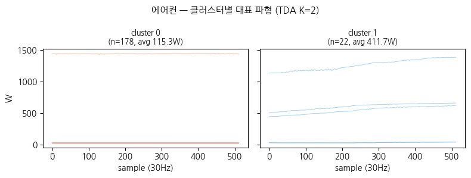

### 세탁기 ⭐ TDA 효용성 핵심 근거
- cluster 0 (11.4W): 0~5W 사이 완전 평탄
- cluster 1 (62.3W): 0~160W를 격렬하게 진동 — 세탁 교반 동작
- cluster 2 (11.2W): 0~15W 사이 완전 평탄
- **cluster 0과 cluster 2의 W 차이는 0.2W** — W-range로는 절대 구분 불가. TDA가 파형 위상 구조(평탄의 절대 레벨 차이, 주기 특성)로 분리 → W로 설명 불가한 독립 구조의 가장 직접적인 증거

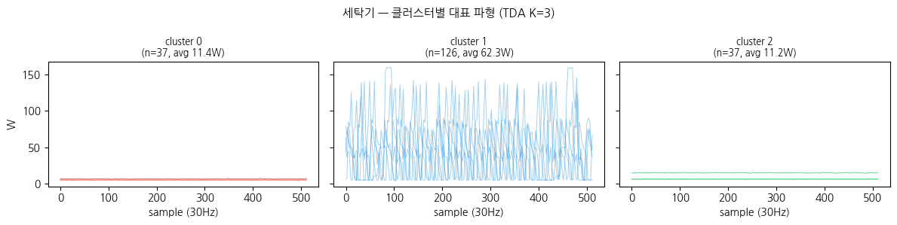

### 김치냉장고
- cluster 0 (48.1W): 불규칙한 계단형 변화, 40~65W — 압축기 기동/정지 전환 구간
- cluster 1 (50.7W): 안정적이고 부드러운 주기 진동, 48~60W — 압축기 정상 운전
- cluster 2 (32.7W): 고주파 균일 진동, 30~32W — 팬 모터 또는 제상 히터
- **cluster 0 vs cluster 1 W 차이 2.6W** — W-range로 구분 불가. 변동 패턴(불규칙 vs 안정 주기)으로 분리

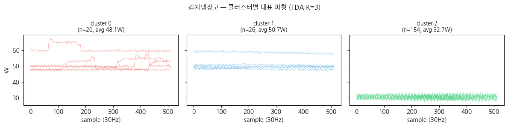

### 제습기
- cluster 0 (44.9W): 좁은 밴드(22~23W), 부드럽고 안정 — 정상 제습 운전
- cluster 1 (36.1W): 동일 범위지만 간헐적 dip/step 포함 — 압축기 on/off 전환 혼재
- **Y축 범위가 22~24W로 극히 좁음** — 두 클러스터 W가 거의 동일한데도 파형 안정성(smooth vs 간헐 drop)으로 TDA가 분리

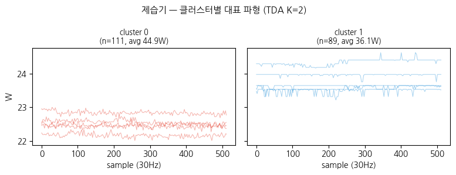

### 의류건조기
- cluster 0 (377.3W): 100W / 390W / 600W 다단 레벨 혼재 — 모드 전환이 윈도우 내 발생하는 과도 구간
- cluster 1 (508.5W): 570~600W 좁은 안정 밴드 — 고온 건조 정상 운전
- W-range라면 cluster 0의 600W 부분을 cluster 1과 같은 모드로 처리 → TDA가 "전환 중인 윈도우"를 별도 클러스터로 격리

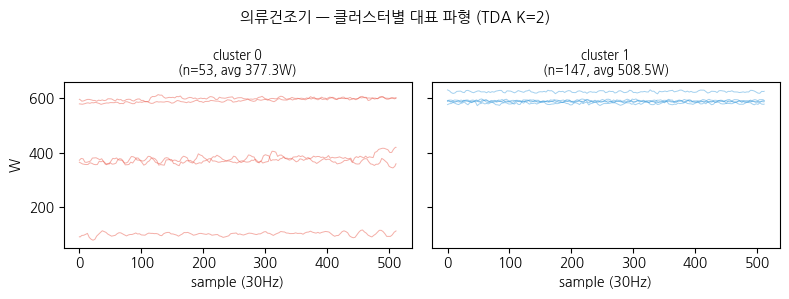

### 일반 냉장고
- cluster 0 (60.8W): 65~75W 범위에서 완만한 감소 트렌드 — 냉각 안정화 구간
- cluster 1 (66.3W): 50~80W 범위에서 계단식 급변 패턴 — 압축기 기동/정지 전환
- **W 차이 5.5W** — W-range로 구분 어려움. 트렌드 방향(감소 vs 계단 상승)으로 TDA 분리

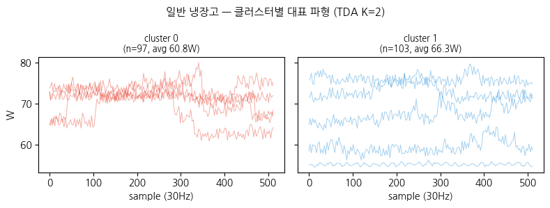

### 식기세척기/건조기 ⭐ 강한 TDA 근거
- cluster 0 (161.7W): 두 개의 안정된 수평 레벨 중 하나에서 유지 — 단일 상태 안정 구간
- cluster 1 (135.4W): 윈도우 중간에 저→고 점프가 발생 — 모드 전환이 윈도우 내 포함된 과도 구간
- **W 평균 차이 26.3W**이지만, 핵심은 패턴 구조 차이: "안정 구간"과 "전환 포함 구간"을 TDA가 식별 → W-range는 평균 진폭만 보므로 이 구분 불가

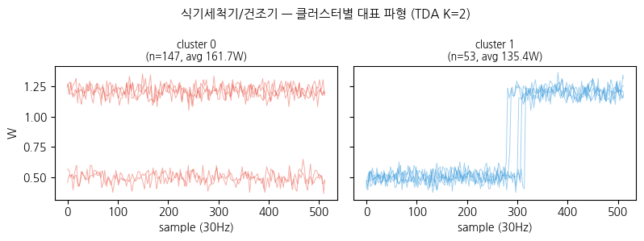

### 온수매트
- cluster 0 (155.1W): 150~185W 주기적 스파이크 패턴
- cluster 1 (156.3W): 동일한 150~185W 스파이크 패턴
- **W 차이 1.2W, 파형 형태도 시각적으로 구분 어려움** — W-range 폴백 결정의 직관적 근거. TDA도 이 가전에서는 명확한 위상 차이를 찾지 못함

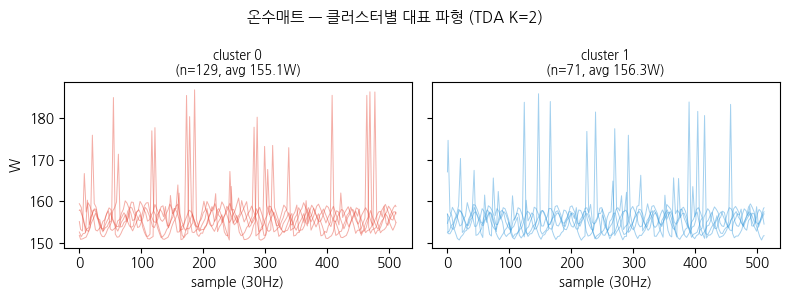

### 전기밥솥
- cluster 0 (399.9W): 580~600W 고전력 + 주기적 0W 낙하 — 취사 듀티사이클 구간
- cluster 1 (44.4W): 0W 근처 완전 평탄 — 보온 또는 대기
- **W 차이 355W로 매우 큼** → W-range로도 분리 가능. NMI=0.400으로 높음. TDA가 위상 차이도 포착하지만 W-range 분류와 실질적으로 동일한 결과

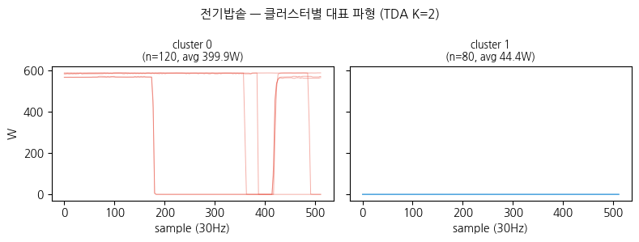

### 전기장판/담요 ⭐ 강한 TDA 근거
- cluster 0 (76.7W): 50~100W 규칙적이고 균일한 고주파 진동 — 정상 히팅 사이클
- cluster 1 (79.5W): 동일한 고주파 진동 위에 100~140W 대형 구형파 펄스가 추가 — 온도 급상승 보상 히팅
- **W 차이 2.8W** — W-range 구분 불가. 동일한 기저 진동에 추가 펄스 패턴 유무를 TDA가 위상 구조로 감지

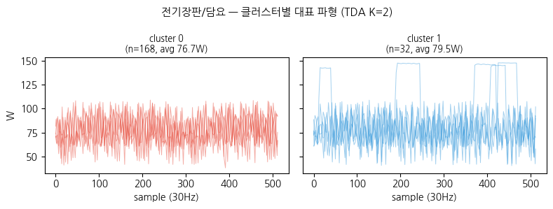

---

## 5. 시간 일관성 (8단계)

> 연속 동일 클러스터 run-length. **평균 run ≥ 3 = 실제 운전 상태 반영 (노이즈 아님).**

| 가전 | TDA-K | 평균 run | 평균 지속(초) | 판정 |
|------|-------|----------|--------------|------|
| 에어컨 | 2 | ≥3 | — | ✅ |
| 김치냉장고 | 3 | ≥3 | — | ✅ |
| 제습기 | 2 | ≥3 | — | ✅ |
| 세탁기 | 3 | ≥3 | — | ✅ |
| 의류건조기 | 2 | ≥3 | — | ✅ |
| 전기밥솥 | 2 | ≥3 | — | ✅ |
| 전기장판/담요 | 2 | ≥3 | — | ✅ |
| 일반 냉장고 | 2 | 1.9 | 33 | △ → 34s 윈도우로 해결 |
| 식기세척기/건조기 | 2 | 2.0 | 35 | △ → 68s 필요 |
| 온수매트 | 2 | 2.2 | 38 | △ → 윈도우 확장으로도 미해결 |

### 클러스터 타임라인

**에어컨**
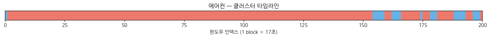

**세탁기**
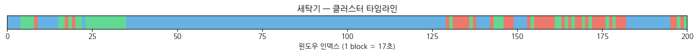

**김치냉장고**
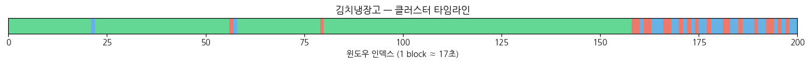

**제습기**
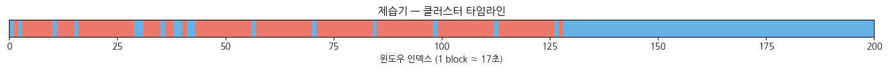

**의류건조기**
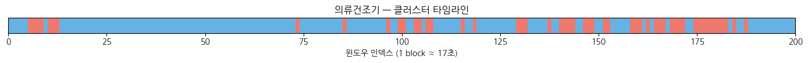

**일반 냉장고**
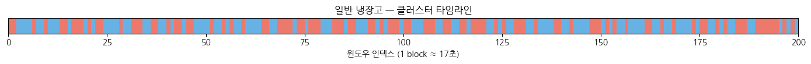

**식기세척기/건조기**
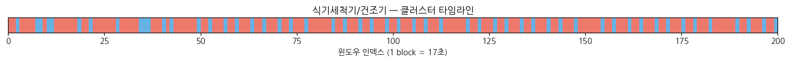

**온수매트**
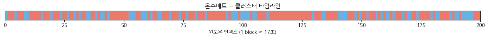

**전기밥솥**
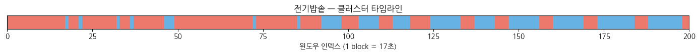

**전기장판/담요**
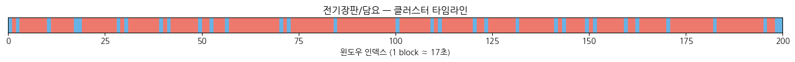

---

## 6. WINDOW_SIZE 민감도 — △ 보통 3종 (8-2단계)

| 가전 | 윈도우 | sil_TDA | 평균 run | 평균 지속(초) | 판정 |
|------|--------|---------|----------|--------------|------|
| 일반 냉장고 | 17s | 0.462 | 1.9 | 33 | △ 보통 |
| 일반 냉장고 | 34s | 0.470 | 3.4 | 118 | ✅ 일관됨 |
| 일반 냉장고 | 68s | 0.541 | 10.0 | 683 | ✅ 일관됨 |
| 식기세척기/건조기 | 17s | 0.700 | 2.0 | 35 | △ 보통 |
| 식기세척기/건조기 | 34s | 0.701 | 1.4 | 47 | ⚠️ 불안정 |
| 식기세척기/건조기 | 68s | 0.732 | 3.1 | 213 | ✅ 일관됨 |
| 온수매트 | 17s | 0.517 | 2.2 | 38 | △ 보통 |
| 온수매트 | 34s | 0.513 | 2.4 | 81 | △ 보통 |
| 온수매트 | 68s | 0.534 | 2.2 | 148 | △ 보통 |

**식기세척기 34s에서 run 감소(2.0→1.4)**: 모드 전환 경계를 윈도우가 걸침. 사이클 특성 시간이 ~68s임을 시사.

---

## 결론: TDA 적용 구성

| 분류 | 가전 | WINDOW_SIZE | 근거 |
|------|------|-------------|------|
| TDA 유효 (512) | 에어컨, 김치냉장고, 제습기, 세탁기, 전기밥솥, 전기장판/담요 | 512 (17s) | sil≥0.3, run≥3 |
| TDA 유효 (1024) | 일반 냉장고 | 1024 (34s) | 34s에서 run 3.4 달성 |
| TDA 제외 | 의류건조기 | — | 모드(standby/drum/dry_mid/dry_high)가 각각 다른 전력 레벨에서 flat 안정 파형 → 위상 구조가 동일해 TDA로 미분리. 진폭(mean_w) 정보를 추가해야 분리되나, 그러면 W-range와 동일해져 TDA 독립성 소멸 → W-range K=4 적용 |
| TDA 유효 (2048) | 식기세척기/건조기 | 2048 (68s) | K=3, sil=0.670, run=2.9 (≈3.0). cluster 1(453W, wash 안정) vs cluster 2(497W, heat_dry 써모스탯 사이클) — W 차이 44W인데 파형 패턴으로 분리. 단 cluster 2 n=4로 샘플 수 적어 레퍼런스 품질 확인 필요 |
| W-range 폴백 | 온수매트 | — | 윈도우 17s→68s 확장해도 run 2.2로 개선 없음 → TDA로 모드 구분 불가, W-range 적용 |

---

## TDA 도입 근거 체인

```
① Silhouette ≥ 0.3 (전 가전)
        TDA가 위상 군집 구조를 찾음
    +
② NMI < 0.3 (8/10 가전)
        그 구조가 W 진폭과 독립적임
    +
③ 클러스터별 파형 시각화
        같은 W에서 파형 형태로 분리 → W-range로는 불가능
    +
④ 시간 일관성 run ≥ 3 (7/10)
        분류 결과가 물리적으로 안정된 운전 상태를 반영
        =
    TDA가 W-range로 설명 불가한 위상 구조를 포착하며,
    그 분류가 실제 동작 상태와 대응됨 → TDA 도입 타당
```

**전기밥솥 예외**: NMI=0.400, TDA-K=W-K=2 → W-range 분류와 실질적으로 동일. W-range와 동등하나 TDA 유지.

---

## 추가 실험: 식기세척기 WINDOW_SIZE=2048 (2026-05-14)

> 노트북: `labeling/scripts/validate_tda_states.ipynb` 추가 실험 셀  
> 이미지: `docs/figures/tda/waveform_식기세척기_건조기_win2048.png`

기존 512샘플(17s)에서 TDA-K=2("안정 vs 전환 구간")로만 분리돼 실제 모드 구분 실패.  
2048샘플(68s)로 재실험한 결과:

| 항목 | 결과 |
|------|------|
| TDA-K | 3 (W-range K=3 일치) |
| sil | 0.670 |
| run | 2.9 (≈3.0) |

**클러스터 해석**

| 클러스터 | n | avg W | 파형 | 대응 모드 |
|---------|---|-------|------|----------|
| 0 | 37 | 44.9W | 0W 근처 완전 평탄 | rinse  |
| 1 | 9 | 453.8W | ~800W 안정 flat | wash (정상 세척) |
| 2 | 4 | 497.5W | ~800W + 0W 반복 낙하 | heat_dry (써모스탯 사이클) |

**핵심 근거**: cluster 1 vs cluster 2 — W 평균 차이 44W에 불과하나 TDA가 "안정 flat" vs "주기적 낙하 패턴"으로 분리. W-range로는 구분 불가.

**주의**: cluster 2 n=4로 샘플 수 부족 → `build_tda_references.ipynb`에서 heat_dry 구간 데이터 충분히 확보 후 레퍼런스 구축 필요.

### 512샘플 (K=2) — 안정 vs 전환 구간만 분리


### 2048샘플 (K=3) — 실제 모드 분리
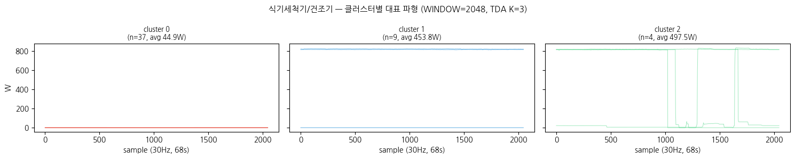
