# 가전 동작 상태 라벨링 계획

> 목적: GCS 한국 30Hz 데이터에 가전별 동작 상태(sub-state) 레이블을 부여하기 위한 기준 수립

---

## 전체 목적 및 파이프라인

### 왜 sub-state 라벨이 필요한가

현재 라벨(`active_inactive`)은 켜짐/꺼짐 구간만 있다.
켜짐/꺼짐 분류는 `F1_CLS`가 담당하므로, 우리가 추가로 파악하고자 하는 것은
**"지금 이 가전이 어떤 동작 모드로 운전 중인가"** 이다.

예: 에어컨이 켜져 있다 (X) → 에어컨이 지금 강풍/약풍/제습 모드이다 (O)

### CNN+TDA 기반 상태 판단 파이프라인

```
집계 전력 신호 (30Hz 원천데이터)
        ↓
CNN+TDA 분해 (현재 모델)
        ↓
가전별 분리된 전력 시계열
  에어컨: [93W, 94W, 91W, ...]
  선풍기: [0W, 0W, ...]
        ↓
윈도우 단위 W_avg, PF 계산
        ↓
임계값 적용 (sub-state 기준)
  93W + PF 0.78 → highcool
  36W + PF 0.81 → highfan
        ↓
상태 확정
```

- **TDA의 역할**: 집계 신호에서 가전별 파형을 정확하게 분리 (분해 단계)
- **상태 판단**: 분리된 파형의 W/PF에 임계값 적용 — 별도 분류기 불필요
- **sub-state 라벨의 용도**: 분해 정확도 검증 ("모델이 93W로 추정했는데 실제 highcool이었는가")

### TDA가 필요한 근거 (PLAID I-V 궤적 분석 결과)

에어컨 highcool vs highfan처럼 W/PF 스칼라만으로 구분이 어려운 상태 쌍이 존재한다.
I-V 궤적을 보면 위상 구조가 달라 TDA가 구분 가능하다.

PLAID 30kHz I-V 궤적을 상태별로 시각 비교한 결과.

### 에어컨
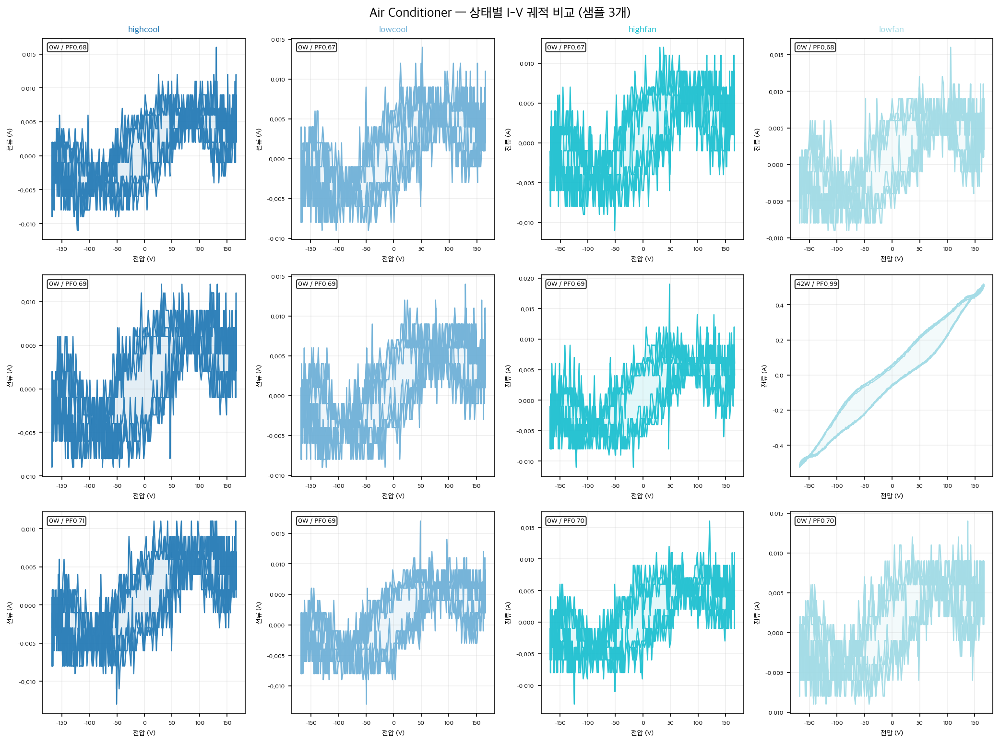

| 상태 쌍 | I-V 형태 차이 | TDA 효용 | 비고 |
|---------|-------------|---------|------|
| cool vs fan | 복잡 노이즈 vs S자 루프 | ✅ 높음 | 위상 구조 완전히 다름 |
| highfan vs lowfan | S자 크기 차이 | ✅ 가능 | lowfan은 거의 직선 |
| highcool vs lowcool | 거의 동일 | ❌ 어려움 | W 3W 차이, 형태도 동일 → 병합 검토 |

### 선풍기
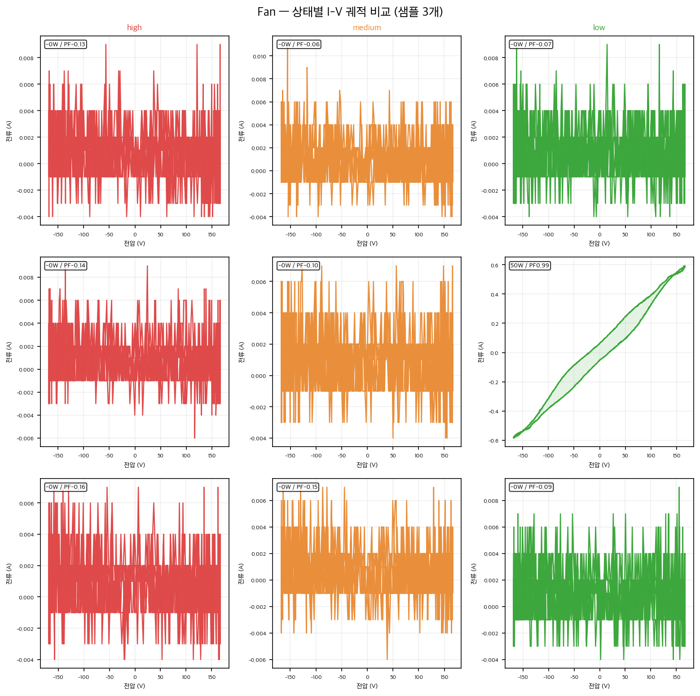

| 상태 쌍 | I-V 형태 차이 | TDA 효용 | 비고 |
|---------|-------------|---------|------|
| high vs medium | 거의 동일 | ❌ 어려움 | W도 32W vs 30W로 근접 |
| high/medium vs low | 대부분 동일, 일부 타원 | △ 제한적 | W 기준(23W)이 더 신뢰 |

### 전자레인지
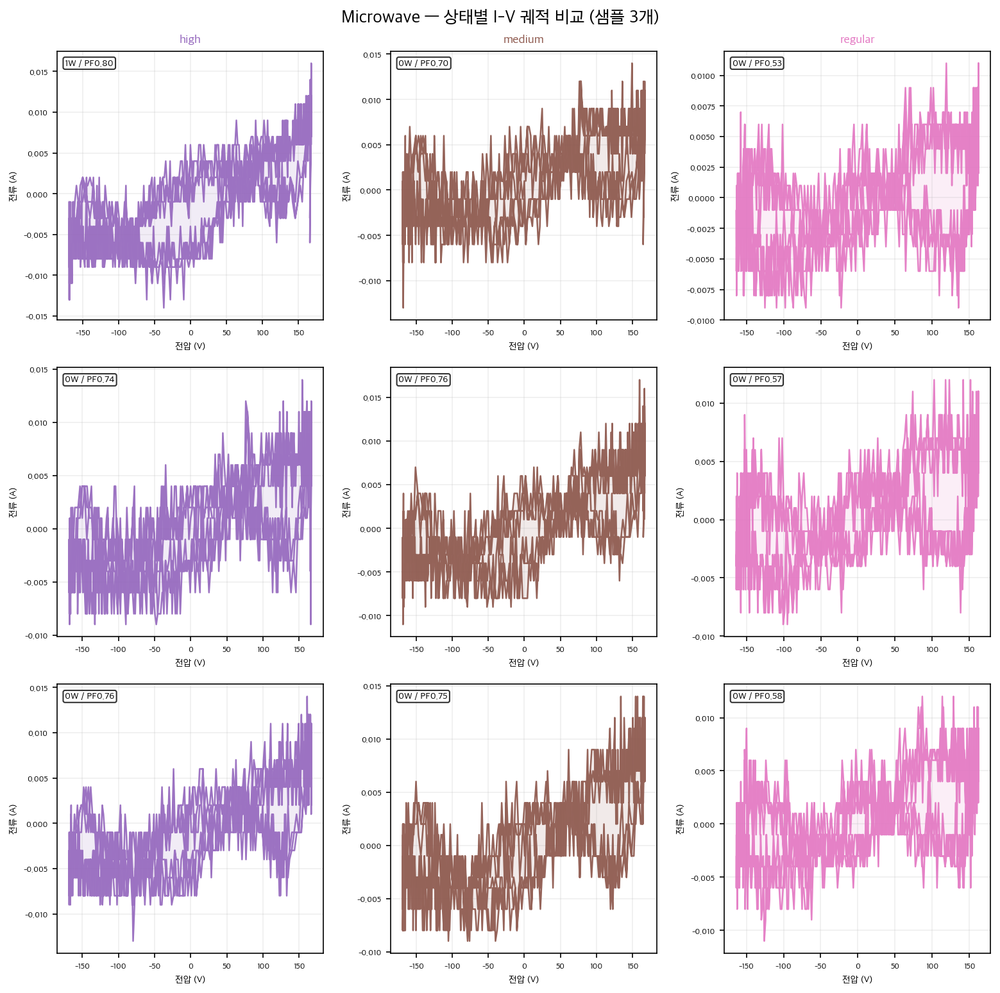

| 상태 쌍 | I-V 형태 차이 | TDA 효용 | 비고 |
|---------|-------------|---------|------|
| high vs medium vs regular | 모두 유사한 복잡 패턴 | ❌ 어려움 | PF 차이(0.56/0.53/0.48)가 유일한 단서 |

### 헤어드라이기
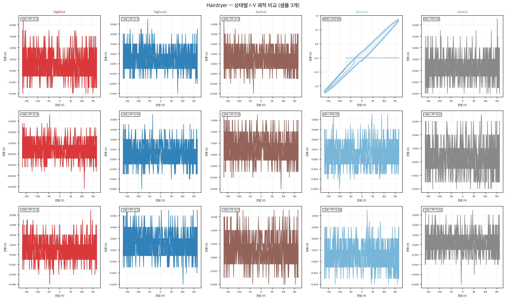

| 상태 쌍 | I-V 형태 차이 | TDA 효용 | 비고 |
|---------|-------------|---------|------|
| highhot vs 나머지 | 넓고 촘촘한 패턴 vs 좁음 | ✅ 높음 | W 580W로 스케일 자체가 다름 |
| noheat vs 나머지 | 매우 좁고 작음 | ✅ 높음 | 팬만 돌아가는 상태, 형태 명확 |
| lowhot vs lowcool | 일부 샘플에서 형태 차이 | △ 가능성 있음 | lowcool 일부가 깔끔한 타원 |
| highhot vs lowhot | W 스케일 차이 (580 vs 177W) | ✅ 가능 | 크기 차이로 구분 |

### 종합

| 가전 | TDA로 구분 가능한 상태 | 구분 어려운 상태 (병합 검토) |
|------|----------------------|--------------------------|
| 에어컨 | cool vs fan, highfan vs lowfan | highcool vs lowcool |
| 선풍기 | high/medium vs low (제한적) | high vs medium |
| 전자레인지 | — | high/medium/regular 전체 (PF만 활용) |
| 헤어드라이기 | highhot, noheat, lowhot vs lowcool | highwarm/highheat 중간값들 |

---

## 현황

| 항목 | 내용 |
|------|------|
| 참고 데이터 | PLAID (미국, 110V, 30kHz, 11종 가전) |
| 대상 데이터 | GCS 한국 30Hz 집계 전력 데이터 (22종 가전) |
| 현재 레이블 | 가전 켜짐/꺼짐 이벤트만 존재, sub-state 없음 |

---

## 한국 데이터 컬럼 구조 확인 결과

> `nilm-engine/datasets/house_022/` 로컬 샘플 기준 (GCS 전체 동일 구조)

### 원천데이터 (`원천데이터/ch01.parquet`)
```
date_time, active_power, voltage, current, frequency,
apparent_power, reactive_power, power_factor,
phase_difference, current_phase, voltage_phase
```
- 샘플링: 30Hz
- `active_power` = W, `power_factor` = PF, `current` = I 직접 사용 가능
- `crest_factor`는 컬럼 없음 → 필요 시 `current` 시계열에서 직접 계산

### 라벨데이터 (`라벨데이터/ch05.parquet`)
- `active_inactive`: 켜짐/꺼짐 시간 구간 리스트만 존재
- sub-state 레이블 없음 → 직접 기준 수립 필요

### PLAID 번역 시 컬럼 매핑

| PLAID 피처 | 한국 데이터 컬럼 | 보정 필요 여부 |
|---|---|---|
| 유효전력 W | `active_power` | 없음 (W는 전압 무관) |
| 역률 PF | `power_factor` | 없음 (부하 특성값) |
| 전류 I_rms | `current` | 없음 (실측값) |
| 위상차 | `phase_difference` | 없음 |
| crest factor | 직접 계산 필요 | — |

→ 전압 차이(110V vs 220V) 보정 불필요. `active_power` 기준은 그대로 적용 가능.

---

## 문제점

### 1. 샘플링 레이트 불일치 (핵심 문제)
- PLAID: 30kHz → 1사이클(16.7ms)에 500포인트 → I-V 궤적 직접 시각화 가능
- 한국 데이터: 30Hz → 1초에 30포인트 → AC 1사이클 자체를 포착 불가
- **결과**: PLAID의 I-V 궤적 형태를 한국 데이터에 직접 적용 불가

### 2. 전압 차이
- PLAID: 110V (미국 단상)
- 한국: 220V → 전압 축 스케일 2배 차이, 전류값도 절반 수준

### 3. 한국 고유 가전 미포함
- PLAID에 없는 가전 (13종): 전기밥솥, 인덕션, 전기장판, 온수매트, 제습기, 공기청정기, 전기다리미, 김치냉장고, 에어프라이어, 의류건조기, 전기포트, TV, 무선공유기
- 이 가전들은 PLAID를 참고할 수 없어 한국 데이터에서 직접 기준 도출 필요

### 4. 검증 정답 데이터 부재
- 상태 레이블이 없으므로 라벨링 결과의 정확도를 검증할 수단이 없음

---

## 해결 전략

### Step 1. PLAID → 30Hz 피처 번역

PLAID I-V 궤적에서 관찰되는 상태 차이를 30Hz에서 계산 가능한 피처로 변환한다.

| I-V 궤적 특성 (PLAID) | 30Hz 대응 피처 |
|----------------------|---------------|
| 타원 넓이 (크다 = 고출력) | 유효전력 W |
| 타원 기울기 (위상차) | 역률 PF |
| 비선형 꺾임 정도 | 전류 파고율 (crest factor) |
| 궤적 크기 | 전류 RMS (I_rms) |

### Step 2. PLAID 기반 가전별 상태 임계값 초안 수립

PLAID 데이터에서 각 상태별 `active_power_w`, `power_factor`, `i_rms` 통계를 추출해 임계값 초안을 만든다.

```
예시 — 헤어드라이기:
  highhot  : W > 1400, PF > 0.95  (저항 + 고출력)
  highcool : W > 1400, PF < 0.90  (모터 추가)
  lowhot   : 700 < W ≤ 1400, PF > 0.95
  noheat   : W < 200              (팬만)
```

### Step 3. 한국 데이터 클러스터링으로 pseudo-label 생성

PLAID 참고가 불가한 가전 및 검증 목적으로, 한국 데이터에서 직접 클러스터링을 수행한다.

- 피처: `[W, PF, I_rms, crest_factor]` 정규화 후 K-Means / GMM
- 클러스터 수: PLAID 상태 수를 참고해 초기값 설정 (예: 에어컨 4개)
- 클러스터 결과와 Step 2 임계값을 대조해 레이블 명칭 부여

### Step 4. 수작업 검토 및 확정

- 클러스터별 대표 샘플 10~20개를 waveform_viewer 스타일로 시각화
- 도메인 지식 기반 수작업 검토로 레이블 확정
- 모호한 경계 샘플은 `unknown` 처리 후 제외

---

## 가전별 우선순위

| 우선순위 | 가전 | PLAID 참고 가능 | 비고 |
|---------|------|:--------------:|------|
| 1 | 에어컨 | ✅ | 상태 수 많음 (4종) |
| 1 | 선풍기 | ✅ | 풍량 3단계 명확 |
| 1 | 전자레인지 | ✅ | 출력 레벨 구분 |
| 2 | 헤어드라이기 | ✅ | 열/바람 조합 |
| 3 | 세탁기 | ❌ | PLAID off-on만 → 클러스터링으로 |
| 3 | 진공청소기 | ❌ | PLAID off-on만 → 클러스터링으로 |
| 3 | 냉장고 | ❌ | PLAID off-on만 → 클러스터링으로 |
| 3 | 전기밥솥 | ❌ | 취사/보온 클러스터링으로 |
| 3 | 인덕션 | ❌ | 화력 단계 클러스터링으로 |
| 4 | 나머지 9종 | ❌ | 클러스터링 + 수작업 |

---

## PLAID I-V 궤적 레퍼런스 (110V 기준)

> 전압 스케일은 다르지만 궤적 모양(기울기·타원 넓이·비선형성)은 부하 특성에서 비롯되므로 라벨링 기준 참고용으로 유효

### Air Conditioner
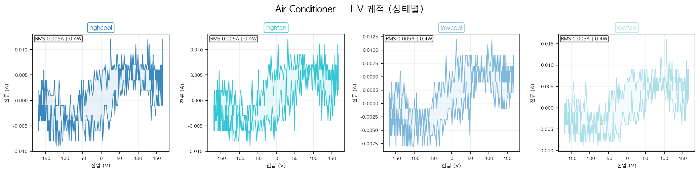

### Fan
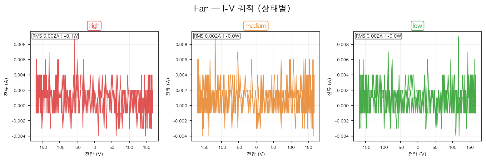

### Hairdryer
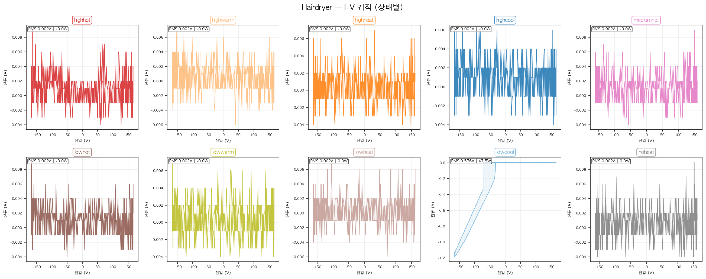

### Microwave
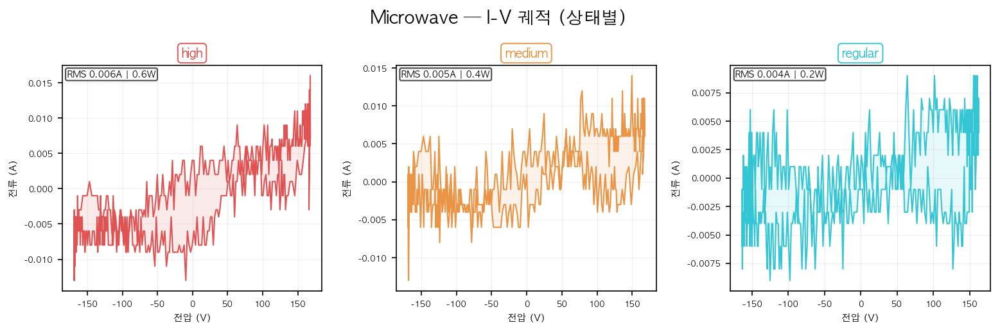

### Vacuum
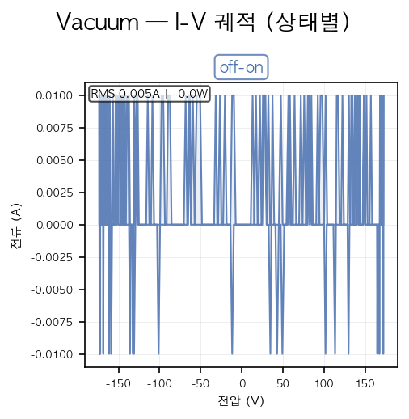
> ⚠️ PLAID 상태가 `off-on` 하나뿐 — sub-state 기준으로 쓸 수 없음. 켜짐/꺼짐은 F1_CLS가 담당하므로 라벨링 불필요.

### Washing Machine
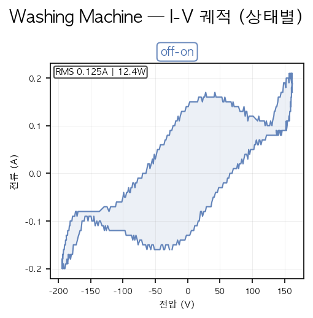
> ⚠️ PLAID 상태가 `off-on` 하나뿐 — sub-state 기준으로 쓸 수 없음. 켜짐/꺼짐은 F1_CLS가 담당하므로 라벨링 불필요.

### Fridge
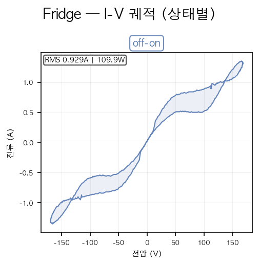
> ⚠️ PLAID 상태가 `off-on` 하나뿐 — sub-state 기준으로 쓸 수 없음. 켜짐/꺼짐은 F1_CLS가 담당하므로 라벨링 불필요.

---

## EDA 결과 — KR 데이터 기반 임계값 초안

> 출처: `nilm-engine/labeling/colab_gcs_state_eda_result.ipynb`
> 데이터: GCS `$GCS_NILM_DATA_PREFIX` (환경변수), 10가구, 30Hz

### 데이터 규모

| 가전 | 채널 수 | 켜짐 샘플 합계 |
|------|--------|--------------|
| 에어컨 | 9 | 23,812,533 |
| 선풍기 | 10 | 59,779,452 |
| 전자레인지 | 9 | 2,401,427 |
| 헤어드라이기 | 9 | 2,024,139 |

### PLAID 적용 가능성 평가

| 가전 | W | PF | 결론 |
|------|---|----|----|
| 에어컨 | ❌ KR max 29W, PLAID min 30W — 한국 인버터 AC는 가변 저전력 운전 | ❌ KR 0.1~0.6, PLAID 0.76~0.83 — 완전 불일치 | PLAID 무의미, KR 골짜기 사용 |
| 선풍기 | ✅ KR 21~35W, PLAID 23~32W — 잘 겹침 | △ KR 0.8 피크가 PLAID 0.77과 근사 | PLAID 임계값 직접 참고 가능 |
| 전자레인지 | ❌ KR 905~1133W, PLAID 210~228W — 220V 기기로 4~5배 차이 | ❌ KR PF ≈ 0.9, PLAID 0.48~0.56 | PLAID 무의미, KR 골짜기 사용 |
| 헤어드라이기 | △ KR 118~1453W, PLAID 22~581W — 부분 겹침 | △ KR 0.9~1.0, PLAID 0.77~0.90 — 근사 | 골짜기 기준, PLAID 명칭 참고 |

### 에어컨 품질 미달 채널

| 채널 | mean W | median W | 제외 사유 |
|------|--------|----------|---------|
| house_011/ch13 | 20.5 | 24.2 | mean < 25W, 10~11월 미사용 구간 다수 |
| house_017/ch13 | 15.5 | 21.5 | mean < 25W |
| house_039/ch13 | 13.5 | 16.8 | mean < 25W |
| house_049/ch13 | 23.0 | 23.3 | mean < 25W |
| house_067/ch13 | 18.7 | 16.5 | mean < 25W, 샘플 수 최대(9.6M) |
| house_033/ch13 | 67.4 | 23.8 | ⚠️ mean 기준 통과했으나 4500W 이상 스파이크 발생 → 다른 가전 혼입 또는 측정 오류 추정 |

→ 위 **6채널 전체** 제외 권고. 잔여 신뢰 채널: house_015, house_054, house_063

### 가전별 분포 히스토그램 (켜짐 구간)

#### 에어컨
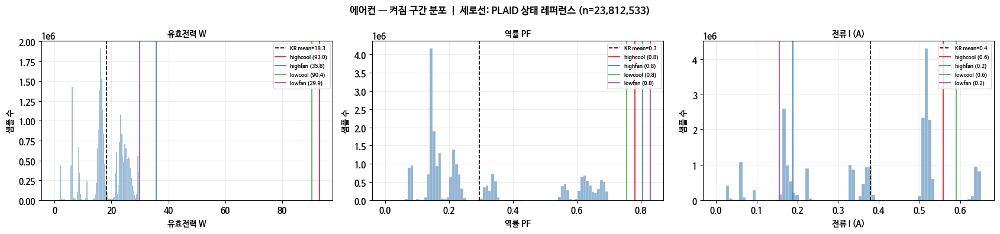

#### 선풍기
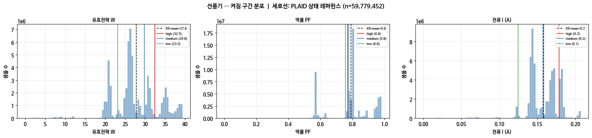

#### 전자레인지
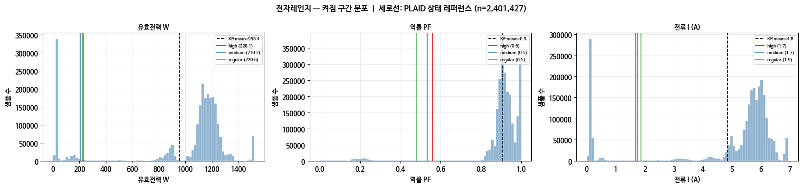

#### 헤어드라이기
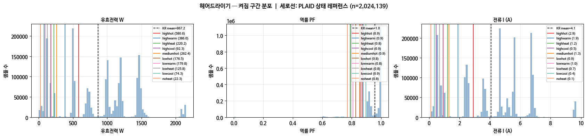

### active_power 시계열 — 에어컨 / 선풍기 / 헤어드라이기 (best 채널 기준)

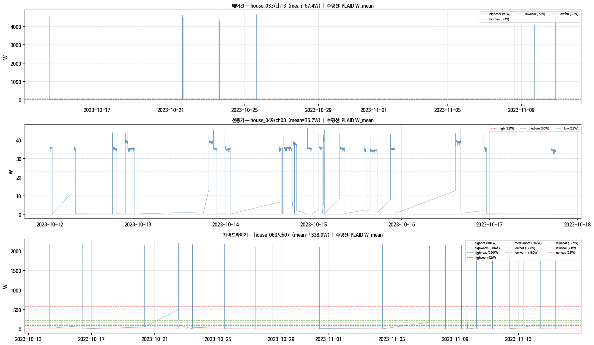

| 가전 | 채널 | 관찰 내용 |
|------|------|---------|
| 에어컨 | house_033/ch13 (mean=67.4W) | ⚠️ 4500W 스파이크 간헐 발생 — 에어컨이 낼 수 없는 수치. 다른 가전 혼입 또는 측정 오류로 추정. mean이 25W 기준을 통과해도 실사용 불가 채널 |
| 선풍기 | house_049/ch03 (mean=36.7W) | on 구간 내 일관되게 33~40W. PLAID high(32W) 근처. 단일 속도 운전 패턴 — 속도 전환 확인은 다른 채널 필요 |
| 헤어드라이기 | house_063/ch07 (mean=1338.9W) | 짧은 사용 이벤트, 피크 ~2200W (PLAID 최대 581W의 4배). 한국 고출력 모델 혼재. 시계열만으로 상태 전환 불확인 → 구간 내부 확대 필요 |

> ⚠️ 에어컨 이상 스파이크 채널 추가: house_033/ch13을 품질 미달 목록에 포함해야 함 (mean 기준 통과했으나 4500W 이상값으로 실사용 불가)

---

### 가전별 KR 군집 피크 및 골짜기 임계값 초안

#### 에어컨 (active_power 기준)

| 구간 번호 | KR 피크 (W) | 분리 골짜기 (W) |
|---------|------------|--------------|
| 1 | 1.9 | 3.7 |
| 2 | 6.1 | 7.6 |
| 3 | 8.5 | 10.6 |
| 4 | 16.2 | 19.8 |
| 5 | 21.6 | 22.2 |
| 6 | 23.1 | 24.3 |
| 7 | 24.9 | 28.4 |
| 8 | 29.3 | — |

> ⚠️ 8개 군집은 인버터 AC의 압축기 RPM 단계로 추정. PLAID 상태명 직접 매핑 불가. 클러스터링 후 단계 수 재검토 권장.

#### 선풍기 (active_power 기준) ✅ 확정

| 상태명 | 임계값 (W) | 해당 채널 | PLAID 대응 |
|-------|----------|---------|----------|
| `low` | W < 22.6 | house_011, 017 | PLAID low (23.2W) |
| `medium` | 22.6 ≤ W < 32.9 | house_033, 039, 063, 067 | PLAID medium (29.8W) |
| `high` | W ≥ 32.9 | house_015, 049 | PLAID high (32.5W) |


> 전 채널 시계열 확인 결과: 한 켜짐 세션 내 속도 전환은 거의 없음. 5개 KR 피크는 가구별 선호 속도 분포이며, 22.6W / 32.9W 골짜기가 가구간 속도 차이를 명확히 분리함. 3단계 확정.

#### 전자레인지 (active_power 기준) ✅ 확정

| 상태명 | 임계값 (W) | KR 피크 | 비고 |
|-------|----------|--------|------|
| `standby` | W < 692 | 22.8W | 문 열림·대기·예열 구간 포함 |
| `low` | 692 ≤ W < 996 | 904.8W | 저출력 조리 |
| `high` | W ≥ 996 | 1132.9W | 고출력 조리 |

> PLAID(210~228W)와 완전 불일치 — 한국 220V 기기. PF ≈ 0.9 단일 군집으로 PF 구분 불가. W 기반 골짜기(692W / 996W)만 사용. 3단계 확정.

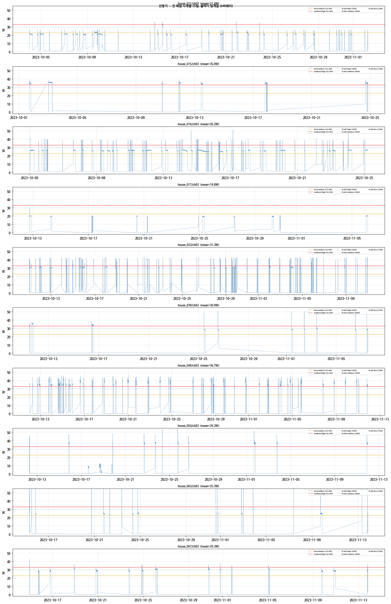

> 전 채널 시계열 확인 결과: house_011, 033, 054 등 같은 가구에서 ~905W 및 ~1133W 두 출력이 모두 관측됨. 모델 차이가 아닌 동일 기기의 조리 출력 설정 차이. 692W / 996W 경계 유효, 3단계 확정.

#### 헤어드라이기 (active_power 기준)

| 구간 번호 | KR 피크 (W) | PLAID 근사 상태 | 분리 골짜기 (W) |
|---------|------------|--------------|--------------|
| 1 | 118.4 | lowcool(74W), lowheat(126W) | 139.9 |
| 2 | 226.0 | highheat(220W) | 269.1 |
| 3 | 505.8 | highhot(581W) | 548.9 |
| 4 | 699.6 | — | 828.7 |
| 5 | 1000.9 | — | 1044.0 |
| 6 | 1194.6 | — | 1302.3 |
| 7 | 1452.9 | — | — |

> KR 헤어드라이기가 220V 고출력 모델 포함으로 PLAID(최대 581W)보다 범위 넓음.

---

## 전체 가전 골짜기 탐지 결과 (22종)

> 출처: `nilm-engine/labeling/scripts/colab_gcs_state_eda_all_result.ipynb`
> 방법: `load_raw_channel` 전체 로드 + `W > 5W` 필터, EDA_HOUSES 10가구, 가전당 최대 1M 샘플

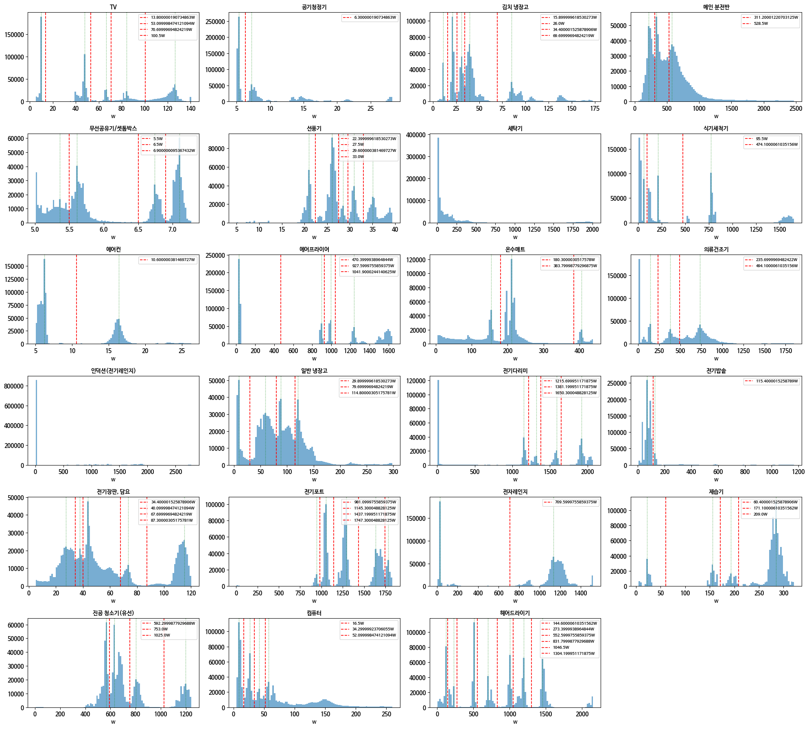

### 골짜기 탐지 요약

| 가전 | 피크 수 | 골짜기(W) | 방법 | 비고 |
|------|---------|----------|------|------|
| 공기청정기 | 2 | 6.3 | valley | 저전력 2단계 |
| 식기세척기 | 3 | 95.5 / 474.1 | valley | 헹굼·세척·건조 |
| 에어프라이어 | 4 | 470.4 / 927.6 / 1041.9 | valley | 대기(30W)·저·중·고 |
| 온수매트 | 3 | 180.3 / 383.8 | valley | 저·중·고 |
| 의류건조기 | 3 | 235.7 / 494.1 | valley | 저·중·고 |
| 일반 냉장고 | 4 | 29.9 / 79.7 / 114.8 | valley | 팬·저·중·고 압축 |
| 전기다리미 | 4 | 1215.7 / 1381.2 / 1650.3 | valley | 저·중·고·최고 온도 |
| 전기밥솥 | 2 | 115.4 | valley | 보온·취사 |
| 제습기 | 4 | 60.4 / 171.1 / 209.0 | valley | 팬전용·저·중·고 |
| 진공청소기(유선) | 4 | 592.3 / 753.0 / 1025.0 | valley | 저·중·고·최강 |
| 컴퓨터 | 4 | 16.5 / 34.3 / 52.1 | valley | 절전·유휴·중부하·고부하 |
| TV | 5 | 13.8 / 53.1 / 70.7 / 100.5 | K-Means | 피크 간격 좁음, 병합 필요 |
| 김치냉장고 | 5 | 15.9 / 26.0 / 34.4 / 69.7 | K-Means | 69.7W 이후 구간 확인 필요 |
| 전기장판·담요 | 5 | 34.4 / 40.1 / 67.7 / 87.3 | K-Means | 피크 간격 좁음 |
| 전기포트 | 5 | 981.1 / 1145.3 / 1437.2 / 1747.3 | K-Means | 900W 이상 집중, 모델 차이 가능 |
| 헤어드라이기 | 7 | 144.6 / 273.4 / 552.6 / 831.8 / 1046.5 / 1304.2 | K-Means | 병합 검토 중 |
| 세탁기 | 0 | — | 별도 | 사이클별 연속 변화, flat 분포 |
| 인덕션(전기레인지) | 0 | — | 별도 | 연속 출력 제어, 피크 없음 |
| 메인 분전반 | 3 | — | 제외 | 단일 가전 아님, 집 전체 합산 |
| 무선공유기/셋톱박스 | 4 | — | 단일상태 | 4피크 전부 5.4~7.1W 이내, 실질 1상태 |
| 에어컨 | 2 | 10.6 | K-Means | 3채널로 별도 클러스터링 예정 |
| 전자레인지 | — | 692 / 996 | valley | 기확정, W>5W 필터로 대기 피크 혼입 |
| 선풍기 | — | 22.6 / 32.9 | valley | 기확정 |

### K-Means 클러스터링 결과 (전체 가전)

> 방법: K=2~6 범위, 실루엣 점수로 최적 K 선택, `active_power` 1D 클러스터링

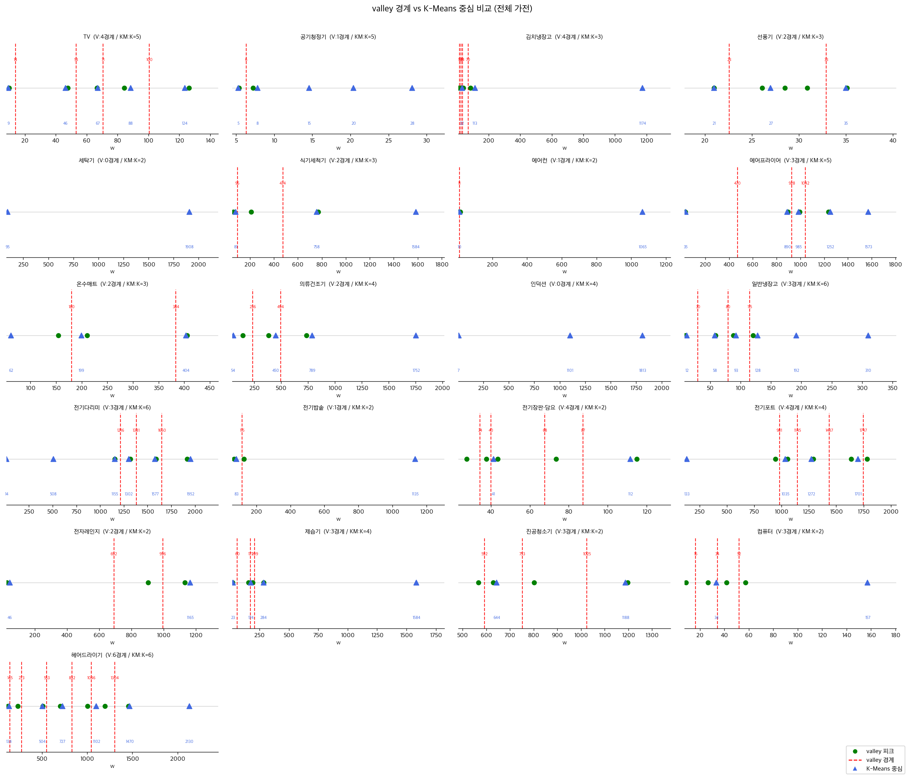

> 빨간 점선 = valley 경계, 파란 삼각형 = K-Means 클러스터 중심, 초록 점 = valley 피크

| 가전 | 최적 K | 실루엣 | K-Means 중심(W) | valley K | 판정 |
|------|--------|--------|----------------|----------|------|
| TV | 5 | 0.800 | 9 / 46 / 67 / 88 / 124 | 5 | ✅ 일치 |
| 공기청정기 | 5 | 0.820 | 5.3 / 7.8 / 14.6 / 20.4 / 28.1 | 2 | ⚠️ 불일치 — 검토 필요 |
| 김치냉장고 | 3 | 0.786 | 31.5 / 112.9 / **1174** | 5 | ⚠️ 1174W 채널 오염 의심 |
| 선풍기 | — | — | — | — | ✅ 기확정 (22.6/32.9W) |
| 세탁기 | 2 | 0.933 | 95 / 1908 | 0피크 | ✅ K-Means로 2단계 발견 |
| 식기세척기 | 3 | 0.888 | 81 / 758 / 1584 | 3 | ✅ 일치 |
| 에어컨 | 2 | 0.994 | 10 / **1065** | 2 | ⚠️ 1065W 채널 오염 의심 |
| 에어프라이어 | 5 | 0.890 | 35 / 890 / 985 / 1252 / 1573 | 4 | ⚠️ valley 4 vs KM 5 — 검토 필요 |
| 온수매트 | 3 | 0.719 | 62 / 199 / 404 | 3 | ✅ 일치 |
| 의류건조기 | 4 | 0.694 | 55 / 450 / 789 / 1752 | 3 | ⚠️ valley 3 vs KM 4 — 검토 필요 |
| 인덕션(전기레인지) | 4 | 0.959 | 7 / 1101 / 1813 / 3007 | 0피크 | ✅ K-Means로 4단계 발견 |
| 일반냉장고 | 6 | 0.612 | 12 / 58 / 93 / 128 / 192 / 310 | 4 | ⚠️ 실루엣 낮음(0.61), 경계 불명확 |
| 전기다리미 | 6 | 0.860 | 14 / 508 / 1155 / 1302 / 1577 / 1952 | 4 | ⚠️ valley 4 vs KM 6 — 508W 중간값 확인 필요 |
| 전기밥솥 | 2 | 0.951 | 83 / 1135 | 2 | ✅ 일치 |
| 전기장판·담요 | 2 | 0.762 | 41 / 112 | 5 | ✅ KM 채택 — valley 과분할 |
| 전기포트 | 4 | 0.841 | 133 / 1035 / 1272 / 1701 | 5 | ✅ KM 채택 — 4단계 |
| 전자레인지 | — | — | — | — | ✅ 기확정 (692/996W) |
| 제습기 | 4 | 0.848 | 23 / 174 / 285 / **1584** | 4 | ⚠️ 1584W 채널 오염 의심 |
| 진공청소기(유선) | 2 | 0.803 | 644 / 1188 | 4 | ✅ KM 채택 — valley 과분할 |
| 컴퓨터 | 2 | 0.730 | 34 / 157 | 4 | ✅ KM 채택 — valley 과분할 |
| 헤어드라이기 | 6 | 0.802 | 135 / 504 / 727 / 1102 / 1470 / **2130** | 7 | ⚠️ 2130W 이상치, valley 7 vs KM 6 |

> ⚠️ **채널 오염 의심 기준**: K-Means 중심이 해당 가전 스펙 범위를 크게 초과하는 경우 (W>5W 필터로 켜짐 구간 외 데이터 혼입 가능)

### 라벨링 방법 선택 기준

| 조건 | 방법 | 근거 |
|------|------|------|
| 히스토그램 피크가 뚜렷하게 분리됨 | 골짜기(valley) 임계값 직접 적용 | 경계가 명확하면 클러스터링 불필요, 해석 쉬움 |
| 피크가 겹치거나 단계 수 불명확 | K-Means / GMM 클러스터링 | 데이터가 경계를 스스로 찾게 함 |
| PLAID 없는 가전 | EDA 먼저 → 위 기준 적용 | PLAID 없어도 히스토그램으로 판단 가능 |

> ⚠️ 골짜기/클러스터링은 **경계 위치**만 알려줌. 각 구간이 어떤 동작 상태인지 **이름은 직접 정의**해야 함.
> - PLAID와 잘 겹치는 가전(선풍기): PLAID 상태명 그대로 차용 가능
> - PLAID 불일치 가전(에어컨·전자레인지): KR 데이터 기준 새 상태명 정의 필요 (예: 에어컨 → `fan_low` / `fan_high` / `cool_low` / `cool_high`)
> - 나머지 13종: 도메인 지식 + 수작업 검토로 상태명 확정

### 다음 단계

**valley/KM 일치 → 상태명만 부여하면 확정 가능**
- [x] 선풍기: 22.6 / 32.9W → low/medium/high
- [x] 전자레인지: 692 / 996W → standby/low/high
- [x] TV: K=2 → standby/on (K=5 피크는 모델 차이로 단순화)
- [x] 식기세척기: K=3 → rinse/wash/heat_dry
- [x] 온수매트: K=3 → low/medium/high
- [x] 전기밥솥: K=2 → keep_warm/cook

**KM 채택 (valley 과분할)**
- [x] 전기장판·담요: K=2 → low/high
- [x] 전기포트: K=4 → keep_warm/boil_low/boil_medium/boil_high
- [x] 진공청소기(유선): K=2 → low/high
- [x] 컴퓨터: K=2 → idle/active

**KM으로 신규 발견**
- [x] 세탁기: K=2 → wash/heat_wash
- [x] 인덕션: K=4 → standby/low/medium/high

**채널 오염 의심 → 정제 후 재클러스터링 완료**
- [x] 에어컨: ≤50W 필터 후 K=3 → [6.8 / 16.3 / 24.9]W (실루엣 0.774)
- [x] 김치냉장고: ≤200W 필터 후 K=3 → [24.8 / 112.6 / 145.5]W (실루엣 0.797)
- [x] 제습기: ≤500W 필터 후 K=3 → [18.2 / 174.9 / 284.2]W (실루엣 0.847)

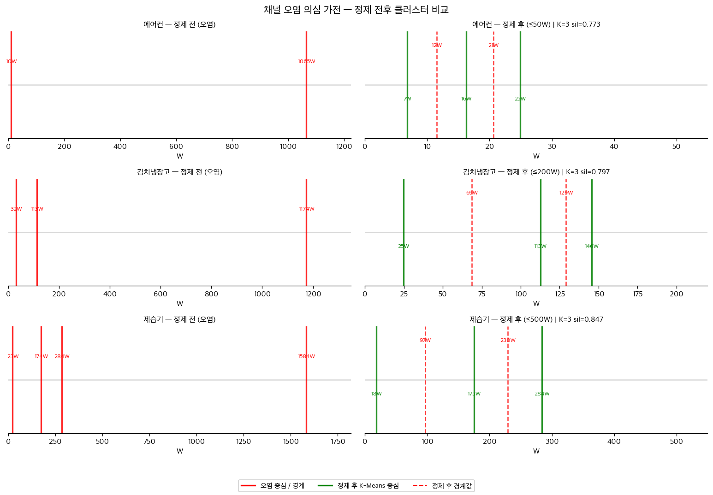

**추가 검토 필요**
- [x] 공기청정기: K=5 → sleep/low/medium/high/turbo (BLDC 팬 RPM 단계)
- [x] 에어프라이어: K=4 → standby/low_temp/mid_temp/high_temp (열선 듀티사이클)
- [x] 의류건조기: K=4 → standby/drum/dry_mid/dry_high (모터+히터 조합)
- [x] 일반냉장고: K=3 → standby/cool/defrost (압축기+제상히터)
- [x] 전기다리미: K=5 → standby/warm/low_temp/mid_temp/high_temp (온도제어)
- [x] 헤어드라이기: K=6 → cool_low/cool_high/warm_low/warm_high/hot_low/hot_high (팬2단×열선3단)

**별도 방법 검토 (2종)**
- [x] 세탁기: ≤700W 재클러스터링 → K=2 wash/spin 확정 (사이클 접근 불필요)
- [x] 인덕션: K=4 → standby/low/medium/high 확정

**제외/단일상태 확정 (2종)**
- [x] 메인 분전반: sub-state 라벨링 대상 제외
- [x] 무선공유기/셋톱박스: 단일 `on` 상태로 처리

**후속 작업**
- [ ] `pseudo_labeler.py` 작성 — 확정된 임계값 적용해 `labeled_states.parquet` 생성

---

## 가전별 상태 정의 (확정)

> 경계값(threshold): K-Means 인접 중심 사이 중간점. 상태명: 도메인 지식 기반.

### 선풍기 ✅
| 상태명 | 범위 (W) | 중심 (W) | 근거 |
|--------|---------|---------|------|
| `low` | W < 22.6 | 21.0 | ✅ PLAID 검증 (PLAID low=23.2W) |
| `medium` | 22.6 ≤ W < 32.9 | 27.0 | ✅ PLAID 검증 (PLAID medium=29.8W) |
| `high` | W ≥ 32.9 | 35.1 | ✅ PLAID 검증 (PLAID high=32.5W) |

### 전자레인지 ✅
| 상태명 | 범위 (W) | 중심 (W) | 근거 |
|--------|---------|---------|------|
| `standby` | W < 692 | 27.7 | 🔵 KR 골짜기 + 도메인 (PLAID 220V 불일치) |
| `low` | 692 ≤ W < 996 | 905 | 🔵 KR 골짜기 + 도메인 (PLAID 220V 불일치) |
| `high` | W ≥ 996 | 1134 | 🔵 KR 골짜기 + 도메인 (PLAID 220V 불일치) |

### TV ✅
| 상태명 | 범위 (W) | 중심 (W) | 근거 |
|--------|---------|---------|------|
| `standby` | W < 27.8 | 9.3 | 🔵 KR K-Means + 도메인 (PLAID 없음) |
| `on` | W ≥ 27.8 | 46~124 | 🔵 KR K-Means + 도메인 (K=5 → 2단계 단순화) |

> K-Means K=5로 피크 5개가 나왔으나 2단계로 단순화한 근거:
> - `standby`(9.3W): TV가 켜진 상태에서 타이머·자동절전으로 화면만 꺼진 구간. 실제 "켜짐" 라벨 내에 존재하는 저전력 상태로 의미 있음.
> - 나머지 4개 피크(46/67/88/124W): 사용자가 선택한 출력 모드가 아닌, **가구마다 다른 TV 모델의 기본 소비전력 차이**일 가능성이 높음. 팬(저속·중속·고속)과 달리 TV는 사용자가 이산적인 전력 단계를 선택하지 않으므로 의미있는 sub-state로 보기 어려움.

### 식기세척기 ✅
| 상태명 | 범위 (W) | 중심 (W) | 근거 |
|--------|---------|---------|------|
| `rinse` | W < 419.4 | 80.8 | 🔵 KR K-Means + 도메인 (PLAID 없음) |
| `wash` | 419.4 ≤ W < 1171.2 | 757.9 | 🔵 KR K-Means + 도메인 (PLAID 없음) |
| `heat_dry` | W ≥ 1171.2 | 1584.4 | 🔵 KR K-Means + 도메인 (PLAID 없음) |

### 온수매트 ✅
| 상태명 | 범위 (W) | 중심 (W) | 근거 |
|--------|---------|---------|------|
| `low` | W < 130.8 | 62.2 | 🔵 KR K-Means + 도메인 (PLAID 없음) |
| `medium` | 130.8 ≤ W < 301.6 | 199.4 | 🔵 KR K-Means + 도메인 (PLAID 없음) |
| `high` | W ≥ 301.6 | 403.7 | 🔵 KR K-Means + 도메인 (PLAID 없음) |

### 전기밥솥 ✅
| 상태명 | 범위 (W) | 중심 (W) | 근거 |
|--------|---------|---------|------|
| `keep_warm` | W < 608.8 | 82.6 | 🔵 KR K-Means + 도메인 (PLAID 없음) |
| `cook` | W ≥ 608.8 | 1135.0 | 🔵 KR K-Means + 도메인 (PLAID 없음) |

### 전기장판·담요 ✅
| 상태명 | 범위 (W) | 중심 (W) | 근거 |
|--------|---------|---------|------|
| `low` | W < 76.5 | 41.4 | 🔵 KR K-Means + 도메인 (PLAID 없음) |
| `high` | W ≥ 76.5 | 111.6 | 🔵 KR K-Means + 도메인 (PLAID 없음) |

### 전기포트 ✅
| 상태명 | 범위 (W) | 중심 (W) | 근거 |
|--------|---------|---------|------|
| `keep_warm` | W < 583.8 | 133.0 | 🔵 KR K-Means + 도메인 (PLAID 없음) |
| `boil_low` | 583.8 ≤ W < 1153.5 | 1034.6 | 🔵 KR K-Means + 도메인 (PLAID 없음) |
| `boil_medium` | 1153.5 ≤ W < 1486.8 | 1272.3 | 🔵 KR K-Means + 도메인 (PLAID 없음) |
| `boil_high` | W ≥ 1486.8 | 1701.3 | 🔵 KR K-Means + 도메인 (PLAID 없음) |

### 진공청소기(유선) ✅
| 상태명 | 범위 (W) | 중심 (W) | 근거 |
|--------|---------|---------|------|
| `low` | W < 916.3 | 644.3 | 🔵 KR K-Means + 도메인 (PLAID off-on만) |
| `high` | W ≥ 916.3 | 1188.2 | 🔵 KR K-Means + 도메인 (PLAID off-on만) |

### 컴퓨터 ✅
| 상태명 | 범위 (W) | 중심 (W) | 근거 |
|--------|---------|---------|------|
| `idle` | W < 95.4 | 33.6 | 🔵 KR K-Means + 도메인 (PLAID 없음) |
| `active` | W ≥ 95.4 | 157.2 | 🔵 KR K-Means + 도메인 (PLAID 없음) |

### 인덕션(전기레인지) ✅
| 상태명 | 범위 (W) | 중심 (W) | 근거 |
|--------|---------|---------|------|
| `standby` | W < 553.8 | 6.9 | 🔵 KR K-Means + 도메인 (PLAID 없음) |
| `low` | 553.8 ≤ W < 1456.8 | 1100.6 | 🔵 KR K-Means + 도메인 (PLAID 없음) |
| `medium` | 1456.8 ≤ W < 2409.8 | 1813.0 | 🔵 KR K-Means + 도메인 (PLAID 없음) |
| `high` | W ≥ 2409.8 | 3006.5 | 🔵 KR K-Means + 도메인 (PLAID 없음) |

### 에어컨 ✅
| 상태명 | 범위 (W) | 중심 (W) |
|--------|---------|---------|
| `fan_low` | W < 11.6 | 6.8 |
| `cool_medium` | 11.6 ≤ W < 20.6 | 16.3 |
| `cool_high` | W ≥ 20.6 | 24.9 |

> ≤50W 필터 적용 후 재클러스터링. 인버터 에어컨 특성상 연속 가변 출력이며 3단계가 최적(실루엣 0.774).

### 김치냉장고 ✅
| 상태명 | 범위 (W) | 중심 (W) |
|--------|---------|---------|
| `fan` | W < 68.7 | 24.8 |
| `cool_low` | 68.7 ≤ W < 129.1 | 112.6 |
| `cool_high` | W ≥ 129.1 | 145.5 |

> ≤200W 필터 적용 후 재클러스터링. K=2(0.795) vs K=3(0.797) 거의 같으나, 팬전용·저출력·고출력 3단계가 물리적으로 유효.

### 제습기 ✅
| 상태명 | 범위 (W) | 중심 (W) |
|--------|---------|---------|
| `fan_only` | W < 96.6 | 18.2 |
| `dehumid_low` | 96.6 ≤ W < 229.6 | 174.9 |
| `dehumid_high` | W ≥ 229.6 | 284.2 |

> ≤500W 필터 적용 후 재클러스터링. 이전 1584W 오염 제거 후 3단계 명확(실루엣 0.847).

### 세탁기 ✅
| 상태명 | 범위 (W) | 중심 (W) |
|--------|---------|---------|
| `wash` | W < 169.2 | 50.4 |
| `spin` | W ≥ 169.2 | 288.1 |

> ≤700W 필터 적용 후 재클러스터링 (정제 후 30,285,971행, 제거 2,121,373행).  
> 이전 on_data_all 기준 K=2 경계 1001.5W는 실제 최대값 585.3W를 초과 → 오염 확인.  
> K=2(0.691) vs K=3(0.688) 거의 같으나, 시계열상 세탁(저전력)/탈수(고전력) 2단계가 물리적으로 명확.  
> K=3 억지 분리 시 wash 구간을 인위적으로 쪼개는 문제 발생 → K=2 확정.

---

## 가전별 상태 정의 — 추가 확정 ✅

### 공기청정기 ✅
| 상태명 | 범위 (W) | 중심 (W) |
|--------|---------|---------|
| `sleep` | W < 6.6 | 5.3 |
| `low` | 6.6 ≤ W < 11.2 | 7.8 |
| `medium` | 11.2 ≤ W < 17.5 | 14.6 |
| `high` | 17.5 ≤ W < 24.3 | 20.4 |
| `turbo` | W ≥ 24.3 | 28.1 |

> KM K=5 (실루엣 0.820). BLDC 팬 모터만 존재하는 구조상 RPM 단계(수면/약/중/강/터보)와 1:1 매칭.  
> valley K=2는 저전력 범위에서 골짜기를 못 찾은 것 — KM K=5 채택.

### 에어프라이어 ✅
| 상태명 | 범위 (W) | 중심 (W) |
|--------|---------|---------|
| `standby` | W < 486 | 35 |
| `low_temp` | 486 ≤ W < 1095 | 938 |
| `mid_temp` | 1095 ≤ W < 1413 | 1252 |
| `high_temp` | W ≥ 1413 | 1573 |

> KM K=5 centers [35/890/985/1252/1573] → 890·985 병합(전압 요동) → K=4 확정 (실루엣 0.890).  
> Thermostatic control: 35W=대기+팬, 나머지 3단계=열선 듀티사이클 차등 제어.

### 의류건조기 ✅
| 상태명 | 범위 (W) | 중심 (W) |
|--------|---------|---------|
| `standby` | W < 253 | 55 |
| `drum` | 253 ≤ W < 620 | 450 |
| `dry_mid` | 620 ≤ W < 1271 | 789 |
| `dry_high` | W ≥ 1271 | 1752 |

> KM K=4 (실루엣 0.694). 모터+히터 부품별 전력 분해: 대기/드럼모터만/모터+히터절반/모터+히터최대.  
> 1752W는 한국 220V 정격 범위 내 — 오염 아님.

### 일반냉장고 ✅
| 상태명 | 범위 (W) | 중심 (W) |
|--------|---------|---------|
| `standby` | W < 52 | 12 |
| `cool` | 52 ≤ W < 172 | 93 |
| `defrost` | W ≥ 172 | 251 |

> KM K=6 (실루엣 0.612) → K=3 단순화. 원본 centers [12/58/93/128/192/310W].  
> 12W=대기/제상타이머, 93W=컴프레서 정상(논문 65~85W 일치), 251W=자동 제상 히터 주기적 가동(200~300W).  
> 재클러스터링으로 경계 재확인 권장.

### 전기다리미 ✅
| 상태명 | 범위 (W) | 중심 (W) |
|--------|---------|---------|
| `standby` | W < 261 | 14 |
| `warm` | 261 ≤ W < 868 | 508 |
| `low_temp` | 868 ≤ W < 1403 | 1228 |
| `mid_temp` | 1403 ≤ W < 1765 | 1577 |
| `high_temp` | W ≥ 1765 | 1952 |

> KM K=6 centers [14/508/1155/1302/1577/1952] → 1155·1302 병합 → K=5 확정.  
> Thermostatic control: 14W=대기, 508W=예열/보온, 나머지=옷감별 열선 다단 제어(실크/면/마).

### 헤어드라이기 ✅
| 상태명 | 범위 (W) | 중심 (W) |
|--------|---------|---------|
| `cool_low` | W < 320 | 135 |
| `cool_high` | 320 ≤ W < 616 | 504 |
| `warm_low` | 616 ≤ W < 915 | 727 |
| `warm_high` | 915 ≤ W < 1286 | 1102 |
| `hot_low` | 1286 ≤ W < 1800 | 1470 |
| `hot_high` | W ≥ 1800 | 2130 |

> KM K=6 (실루엣 0.802). 팬모터(풍량 2단) × 열선(온도 3단) = 6조합과 완벽 매칭.  
> 2130W는 한국 220V 고출력 모델 포함 — 이상치 아님. valley K=7 대신 KM K=6 채택.

---

## 산출물

- `nilm-engine/labeling/iv_patterns/` — 가전별 I-V 궤적 패턴 이미지 (PLAID 기준)
- `nilm-engine/labeling/scripts/export_iv_patterns.py` — 위 이미지 생성 스크립트
- `nilm-engine/labeling/thresholds.yaml` — 가전별 임계값 정의 (작성 예정)
- `anomaly-detection/scripts/pseudo_labeler.py` — 서브미터 기반 상태 라벨 생성기 (작성 예정)
- `anomaly-detection/scripts/state_classifier.py` — 서비스용 실시간 상태 분류기 (작성 예정)
- `labeled_states.parquet` — 최종 상태 레이블 파일 (GCS 업로드)

---

## 후속 진행 계획

### Step 1. thresholds.yaml 작성
확정된 22종 임계값을 공유 config 파일로 추출.  
`pseudo_labeler.py`와 `state_classifier.py` 두 모듈이 동일 파일을 참조.

### Step 2. pseudo_labeler.py 작성
GCS 서브미터 데이터를 읽어 임계값 적용 → 상태 라벨 생성.  
출력: `(house_id, appliance, state, started_at, ended_at, mean_w)` parquet.  
이상탐지 ML의 학습 입력 데이터가 됨.

### Step 3. state_classifier.py 작성
NILM 분해 출력(가전별 추정 W)을 실시간으로 받아 상태를 반환하는 서비스용 모듈.  
thresholds.yaml을 참조해 pseudo_labeler와 동일한 임계값 사용.

### Step 4. 이상탐지 ML 학습
`labeled_states.parquet`를 입력으로 상태별 정상 패턴 학습.  
모델 후보: Autoencoder(패턴 변화), Isolation Forest(이상치), Z-score(단순 전력 이상).  
입력 피처: 상태, W, 시간대, 사용 지속시간, 요일.

### Step 5. 서비스 파이프라인 연결
```
분전반 → CNN+TDA 분해 → state_classifier → 이상탐지 ML → 알림/리포트
```
