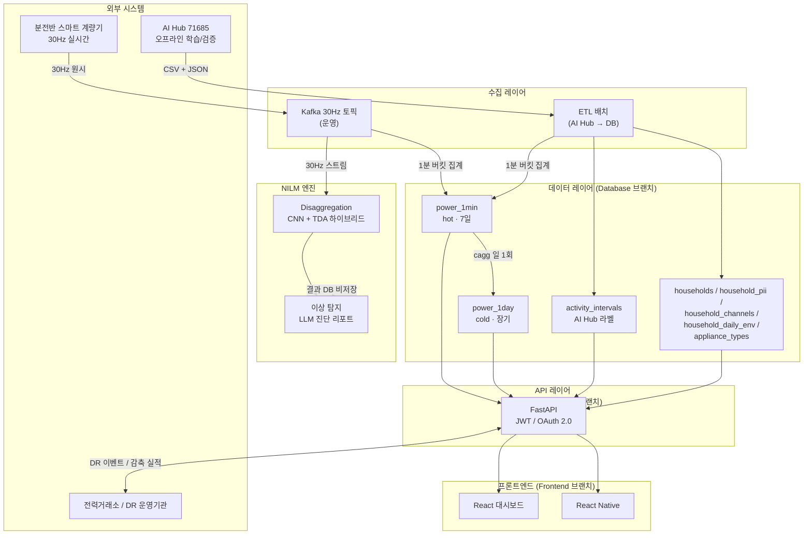

# 시스템 아키텍처

> 아키텍처 설계 완료 후 이 문서를 갱신한다.
> 갱신 트리거: 레이어 간 흐름이 바뀔 때만 수정. 개별 브랜치 내부 구조 변경 시에는 갱신하지 않는다.

## 시스템 개요

NILM 기반 에너지 효율화 서비스 — 단일 분전반 계량기 데이터로 개별 가전 전력 소비를 분해하고,
이상 탐지, DR 참여 분석, 전력거래소 연계를 제공하는 플랫폼.

상위 요구사항은 루트 `CLAUDE.md` REQ-001 ~ REQ-009 참조.

## 아키텍처 다이어그램

### 레이어 구성 및 데이터 흐름

### 브랜치 ↔ 레이어 대응

| 코드 브랜치 | 역할 | 기술 스택 (계획) |
|-------------|------|------------------|
| `Database` | 데이터 레이어 | PostgreSQL 16 + TimescaleDB, SQLAlchemy async, Fernet(AES-256) |
| `Execution_Engine` | NILM 분해·이상탐지 엔진 | PyTorch, scikit-tda, GUDHI, PyWavelets, OpenAI API (GPT-4o-mini, 익명화 후 사용) |
| `API_Server` | FastAPI 백엔드 | FastAPI, JWT/OAuth2, Redis, Celery |
| `Frontend` | 웹/모바일 UI | React, React Native, Recharts, Tailwind |

## 주요 데이터 흐름

### 흐름 1. 오프라인 학습·검증 (AI Hub 데이터)

1. `Database/scripts/ingest_aihub.py` 가 CSV/JSON 쌍을 읽음
2. 30Hz CSV → 1분 버킷 `avg/min/max` + 누적 `energy_wh` 로 집계 → `power_1min` 적재
3. JSON `meta` 24필드 → 5개 정규화 테이블로 분산 저장 (`households` 외)
4. JSON `labels.active_inactive` → `activity_intervals` 초 단위 정밀도 유지
5. `ingestion_log` 에 파일명·원본 행수·집계 행수·상태 기록

### 흐름 2. 실시간 운영 (스마트 계량기)

1. 분전반 → Kafka 30Hz 토픽으로 스트림 전송
2. NILM 엔진이 Kafka 를 컨슘, 로컬 버퍼에서 30Hz 원시를 분해·이상탐지
3. 분해 결과는 엔진 내부 평가용으로만 사용 (DB 비저장 — ADR-001 D4)
4. 동일 스트림에서 1분 집계를 계산 → `power_1min` 적재
5. 이상 이벤트는 별도 `anomaly_events` 테이블(REQ-002, 신규 예정)

### 흐름 3. Hot/Cold 자동 다운샘플 (ADR-001 D3)

1. `power_1min` 에 데이터가 계속 적재
2. 매일 1회 `power_1day` 연속집계(cagg) 가 리프레시 → 이전 일자 1,440개 분 버킷을 1개 일 버킷으로 요약
3. `power_1min` retention 정책이 7일 이상 chunk 자동 드롭 (cold 는 이미 요약 완료)
4. 대시보드는 hot/cold 를 투명하게 조회

### 흐름 4. DR 정산 (REQ-005)

1. 전력거래소 → API 로 DR 이벤트 수신 (`dr_event` 테이블, 신규 예정)
2. 이벤트 기간 중 `power_1min` 실측 vs 기준부하 baseline 차이로 감축 실적 산출
3. 정산 리포트 → 전력거래소로 전송 (`dr_performance` 신규 예정)

## 보안 경계 (REQ-007)

- **PII 격리**: `household_pii` 테이블은 분석 역할이 직접 SELECT 불가. 관리자 전용 API 엔드포인트만 복호화 후 반환.
- **AES-256 암호화**: 개인정보·자격증명은 DB 저장 전 Fernet 대칭키 암호화. 키는 `CREDENTIAL_MASTER_KEY` 환경변수.
- **TLS 1.3**: API ↔ Frontend, API ↔ 전력거래소 모든 외부 통신.
- **하드코딩 금지**: DB 접속 정보·토큰 모두 환경변수 (`os.getenv`), 기본값에 실제 인프라 값 금지.

## 참조

- 설계 결정: [`decisions.md`](./decisions.md)
- 상세 스키마: [`Database/docs/schema_design.md`](../../Database/docs/schema_design.md)
- 데이터셋 명세: [`Database/docs/dataset_spec.md`](../../Database/docs/dataset_spec.md)
