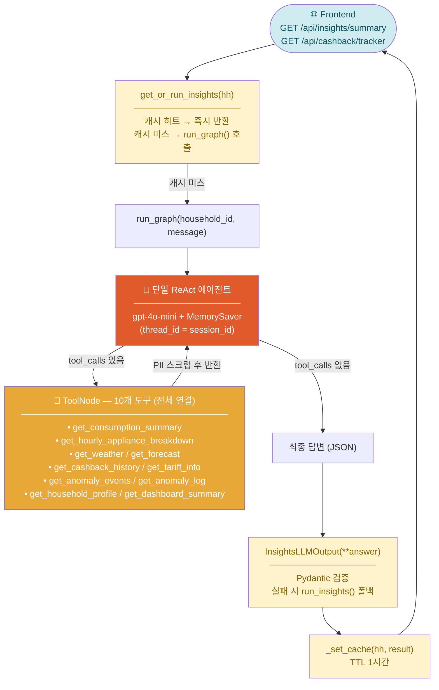

```mermaid
flowchart TD
    FE([🌐 Frontend\nGET /api/insights/summary\nGET /api/cashback/tracker])
    FE --> GOR["get_or_run_insights(hh)\n─────────────────\n캐시 히트 → 즉시 반환\n캐시 미스 → run_graph() 호출"]

    GOR -->|"캐시 미스"| RG["run_graph(household_id, message)"]

    RG --> AGENT["🤖 단일 ReAct 에이전트\n─────────────────\ngpt-4o-mini + MemorySaver\n(thread_id = session_id)"]

    AGENT -->|tool_calls 있음| TOOLS["🔧 ToolNode — 10개 도구 (전체 연결)\n─────────────────────────────────\n• get_consumption_summary\n• get_hourly_appliance_breakdown\n• get_weather / get_forecast\n• get_cashback_history / get_tariff_info\n• get_anomaly_events / get_anomaly_log\n• get_household_profile / get_dashboard_summary"]

    TOOLS -->|"PII 스크럽 후 반환"| AGENT
    AGENT -->|tool_calls 없음| ANSWER["최종 답변 (JSON)"]

    ANSWER --> PARSE["InsightsLLMOutput(**answer)\n─────────────────\nPydantic 검증\n실패 시 run_insights() 폴백"]
    PARSE --> CACHE["_set_cache(hh, result)\nTTL 1시간"]
    CACHE --> FE

    style AGENT fill:#e05a2b,color:#fff
    style TOOLS fill:#e8a838,color:#fff
    style GOR fill:#fff3cd,color:#856404
    style PARSE fill:#fff3cd,color:#856404
    style CACHE fill:#fff3cd,color:#856404
    style FE fill:#d1ecf1,color:#0c5460
```
