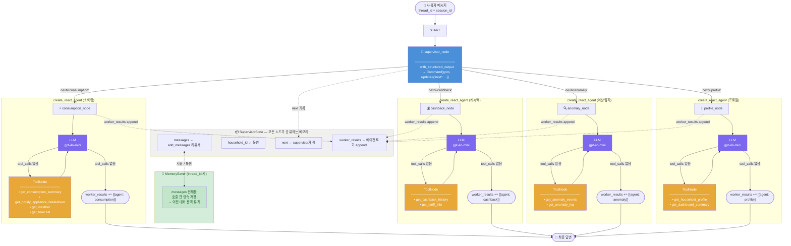

```mermaid
flowchart TD
    USER([👤 사용자 메시지\nthread_id = session_id]) --> START

    START --> SUP["🧠 supervisor_node
    ─────────────────
    with_structured_output
    → Command(goto, update={'next': ...})"]

    SUP -->|"next='consumption'"| CA["⚡ consumption_node"]
    SUP -->|"next='cashback'"| CB["💰 cashback_node"]
    SUP -->|"next='anomaly'"| AN["🔍 anomaly_node"]
    SUP -->|"next='profile'"| PR["👤 profile_node"]

    subgraph STATE["📦 SupervisorState — 모든 노드가 공유하는 메모리"]
        S1["messages ← add_messages 리듀서"]
        S2["household_id ← 불변"]
        S3["next ← supervisor가 씀"]
        S4["worker_results ← 에이전트가 append"]
    end

    subgraph CKPT["💾 MemorySaver (thread_id 키)"]
        CK["messages 전체를\n호출 간 영속 저장\n→ 이전 대화 문맥 유지"]
    end

    SUP -. "next 기록" .-> S3
    CA -. "worker_results append" .-> S4
    CB -. "worker_results append" .-> S4
    AN -. "worker_results append" .-> S4
    PR -. "worker_results append" .-> S4
    S1 <-. "저장 / 복원" .-> CK

    subgraph CA_inner["create_react_agent (소비량)"]
        CA --> CA_LLM["LLM\ngpt-4o-mini"]
        CA_LLM -->|tool_calls 있음| CA_TOOL["ToolNode\n─────────────────\n• get_consumption_summary\n• get_hourly_appliance_breakdown\n• get_weather\n• get_forecast"]
        CA_TOOL --> CA_LLM
        CA_LLM -->|tool_calls 없음| CA_END(["worker_results += [{agent: consumption}]"])
    end

    subgraph CB_inner["create_react_agent (캐시백)"]
        CB --> CB_LLM["LLM\ngpt-4o-mini"]
        CB_LLM -->|tool_calls 있음| CB_TOOL["ToolNode\n─────────────────\n• get_cashback_history\n• get_tariff_info"]
        CB_TOOL --> CB_LLM
        CB_LLM -->|tool_calls 없음| CB_END(["worker_results += [{agent: cashback}]"])
    end

    subgraph AN_inner["create_react_agent (이상탐지)"]
        AN --> AN_LLM["LLM\ngpt-4o-mini"]
        AN_LLM -->|tool_calls 있음| AN_TOOL["ToolNode\n─────────────────\n• get_anomaly_events\n• get_anomaly_log"]
        AN_TOOL --> AN_LLM
        AN_LLM -->|tool_calls 없음| AN_END(["worker_results += [{agent: anomaly}]"])
    end

    subgraph PR_inner["create_react_agent (프로필)"]
        PR --> PR_LLM["LLM\ngpt-4o-mini"]
        PR_LLM -->|tool_calls 있음| PR_TOOL["ToolNode\n─────────────────\n• get_household_profile\n• get_dashboard_summary"]
        PR_TOOL --> PR_LLM
        PR_LLM -->|tool_calls 없음| PR_END(["worker_results += [{agent: profile}]"])
    end

    CA_END & CB_END & AN_END & PR_END --> ANSWER([💬 최종 답변])

    style SUP fill:#4a90d9,color:#fff
    style CA_LLM fill:#7b68ee,color:#fff
    style CB_LLM fill:#7b68ee,color:#fff
    style AN_LLM fill:#7b68ee,color:#fff
    style PR_LLM fill:#7b68ee,color:#fff
    style CA_TOOL fill:#e8a838,color:#fff
    style CB_TOOL fill:#e8a838,color:#fff
    style AN_TOOL fill:#e8a838,color:#fff
    style PR_TOOL fill:#e8a838,color:#fff
    style STATE fill:#f0f0f0,color:#333
    style CKPT fill:#d4edda,color:#155724
    style CK fill:#c3e6cb,color:#155724
```
